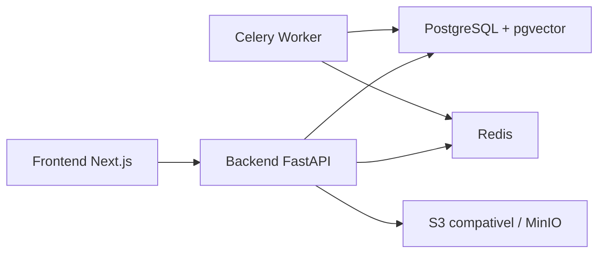

# Arquitetura

## Decisoes da Etapa 1

- API versionada em `/api/v1`.
- Entidades sempre recebem `tenant_id` para preparar isolamento por cliente.
- Alembic controla o schema inicial.
- Autenticacao tem contratos e utilitarios de senha/token; persistencia completa de login depende do seed de usuarios administradores.
