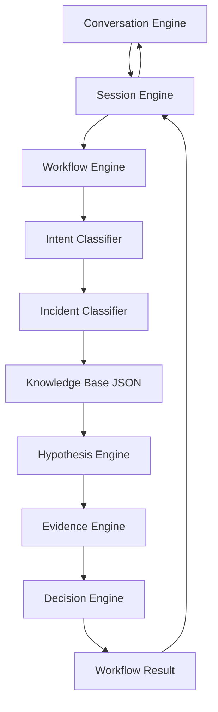

# Visão geral do sistema

## Arquitetura do diagnóstico

## Responsabilidades

- **Conversation Engine:** reconhece comandos, inicia ou continua conversas e apresenta respostas objetivas.
- **Session Engine:** mantém snapshots em memória entre interações, preservando histórico e limites.
- **Workflow Engine:** executa as etapas na ordem fixa e captura falhas como dados.
- **Intent Classifier:** classifica a finalidade da mensagem por regras locais.
- **Incident Classifier:** identifica categoria, severidade e requisitos de atendimento.
- **Knowledge Base:** carrega e consulta incidentes estruturados em JSON.
- **Hypothesis Engine:** gera e ordena hipóteses com confiança limitada a `0.0–1.0`.
- **Evidence Engine:** extrai evidência, atualiza hipóteses e evita aplicação duplicada.
- **Decision Engine:** escolhe pergunta, teste de leitura, confirmação, recomendação, conclusão ou escalada.

## Implementado

- pipeline determinístico e local;
- base de conhecimento versionada no repositório;
- estado de sessão sem estado global;
- comandos de conversa independentes do canal;
- captura estruturada de erros;
- limites e políticas de risco;
- testes automatizados de cada engine;
- nenhuma chamada externa pelo pacote `diagnostic_engine`.

O repositório também possui WhatsApp Cloud API, AI Orchestrator simulado e uma base separada de Remote Agent. Esses subsistemas não estão ligados automaticamente ao fluxo acima.

## Planejado

- Memory Engine;
- Diagnostic Planner;
- Action Planner;
- integração do Conversation Engine ao WhatsApp existente;
- persistência das sessões diagnósticas;
- integração governada com o Remote Agent;
- painel técnico;
- métricas e auditoria do novo fluxo.

## Fora do escopo atual

- execução remota pelo Diagnostic Engine;
- correções automáticas em máquinas de clientes;
- uso de LLM no pipeline determinístico;
- armazenamento em banco das sessões do Session Engine.
